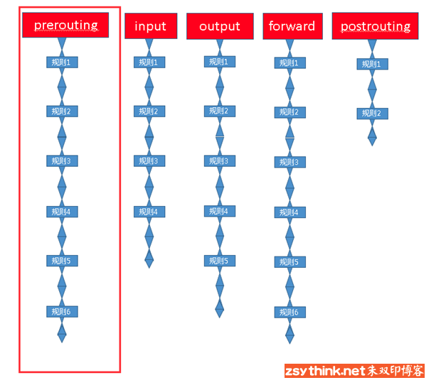
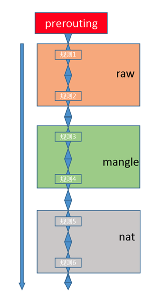
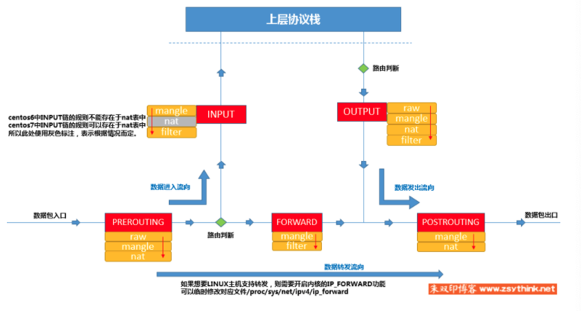
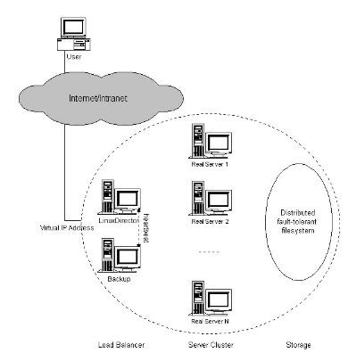

# comparison between iptables, ipvs, nftables and iptables-bpf

## About The Project 

Kubernetes provides three load balancing strategies: namespace, iptables and ipvs. Because the namespace is out of 
date, most k8s clusters adope iptables and IPVS strategies. Almose everyone knows that iptables perform poorly 
compared with IPVS, but why exactly? What's the difference between them? 

Besides, linux kernel has changed the firewall rules management system from iptables to nftables, and since the 
[bpf](https://www.kernel.org/doc/Documentation/networking/filter.txt) and [ebpf](https://ebpf.io/) project have been 
in the air, there is also an iptables implementation of bpf 
([iptables-bpf](https://github.com/mbertrone/bpf-iptables)). So we want to compare these techs as well. 

This project is attemped to compare the difference between the architecture of iptables, ipvs, nftables and 
iptables-bpf, measure the performance loss and update/insert time increment among them. 

### Built With 

* experiment target
    * [iptables](https://netfilter.org/projects/iptables/index.html)
    * [linux virtual server (ipvs)](http://www.linuxvirtualserver.org/)
    * [nftables](https://netfilter.org/projects/nftables/index.html)
    * [bpf-iptables](https://github.com/mbertrone/bpf-iptables)

* performance measurement tools
    * [iperf3](https://iperf.fr/iperf-download.php) for bandwidth measurement
    * simple shell scripts for update/insert time increment

## Getting Started 

### Experiment Environment

| Environment  |       Version |
| ------------ | ------------- |
| CentOS Linux |      7.3.1611 |
| Linux Kernel | 5.10.37-1.el7 |
| iperf3       |          3.17 |
| docker       |    18.06.3-ce |
| iptables     |        1.4.21 |
| ipvsadm      |          1.27 |
| bash         |        4.2.46 |
|              |               |

### Installation

1. repare linux environment and docker 

iptables, IPVS or nftables are free to download and use in all linux environments, so any distributions is all right.

2. Clone the repo 

```sh
git clone git@github.com:9vn6iy/iptables-experiment.git
```

3. run testing scripts

## Contents

### 1. iptables structure

iptables并不是真正的防火墙，而是一个客户端代理，用户通过代理可以将用户自定义的安全规则执行到对应的安全框架中，
例如netfilter。iptables位于用户空间，而netfilters位于内核空间。netfilter/iptables组成linux平台下的包过滤防火墙。

iptables按照rules进行包过滤；规则一般的定义为“如果数据包头符合该要求，则这样处理这个数据包”。
rules存储在kernel空间的信息包过滤表中，指定<source-address, dest-address, protocol, service-type...>

当数据包与rule匹配时，iptables就根据规则所定义的方法处理数据包。数据包的匹配过程分为多个阶段：


其中，`PREROUTING`，`INPUT`，`FORWARD`，`POSTROUTING`，`OUTPUT`都是可以进行packet匹配的位置，被称为chain

为什么它们会被称为`chain`？因为每个匹配位置可能都预置了大量规则，这些规则是以链表的形式挂载到chain上的。
**经过每个chain的报文，都需要将这条chain上的所有规则都匹配一遍。**如果chain上有符合条件的规则，则执行规则对应的动作。



所有的rules都可以分为四类，每一类rules组成一张表：

* filter:   负责过滤功能，位于内核模块`iptables_filter`
* nat:      负责网络地址转换，位于内核模块`iptables_nat`
* mangle:   负责拆解报文并修改后重新封装，位于内核模块`iptables_mangle`
* raw:      负责关闭nat表启用的连接追踪机制，位于内核模块`iptables_raw`

链和表的关系：某种表提供某种功能，可以被挂载到某些hook点（chain）

* raw       -> PREROUTING, OUTPUT
* mangle    -> PREROUTING, INPUT, FORWARD, OUTPUT, POSTROUTING
* nat       -> INPUT, PREROUTING, OUTPUT, POSTROUTING
* filter    -> INPUT, FORWARD, OUTPUT

在数据包经过一个chain时，会将当前chain的所有rules都匹配一遍，则匹配时显然会有顺序，且相同类型的规则会汇聚在一张表中
显然一个chain中不同表会有不同的优先级



实际上，四张表的优先级是预定义的：

```
raw -> mangle -> nat -> filter
```

还可以在某张表里面创建自定义链，但自定义链不能直接使用，只能被某个默认的链当作动作去调用才能起作用

数据包经过防火墙的流程：



规则的组成

* 匹配条件
    * 基本匹配条件: source ip, destination ip
    * 扩展匹配条件: source port, destination port
* 处理动作
    * ACCEPT:       允许数据包通过
    * DROP：        直接丢弃数据包，不给任何回应信息
    * REJECT:       拒绝数据包通过，必要时会给发送端一个响应信息
    * SNAT：        源地址转换，解决内网用户用同一个公网地址上网的问题
    * MASQUERADE:   是SNAT的一种特殊形式，适用于动态的、临时配置的IP上
    * DNAT:         目标地址转换
    * REDIRECT：    在本机进行端口映射
    * LOG:          在`/var/log/messages`文件中记录日志信息，并将数据包传递给下一条规则

### 2. ipvs structure

Linux Virtual Server由三层结构组成：Load balancer, Server pool, Backend Storage 

#### Load Balancer 

* 提供对外服务，是整个系统的前端
* 会将来自client的网络连接分配到server pool中某个合适的server上
* 使用IP负载均衡技术处理连接，并从server pool中选择合适的server，保持并行的连接状态并进行转发
* 这些工作都在kernel内部完成，以降低load balancer的性能开销。
* load balancer可以处理远超普通server可以处理的连接数，并且可以调度大规模server，以保证其短时间内不会成为系统的性能瓶颈。
* load balancer server可以冗余备份以保证高可用
* 扩展性可以通过透明地添加或移除集群节点来保证
* 当系统负载已经达到现有的server node的饱和时，可以添加更多的server nodes来处理工作负载
* 通常情况下，网络服务的依赖并不会太高，因此在load balancer成为系统性能瓶颈之前，聚合性能应该会随着系统中节点的数量线性扩展。
* 由于采用了组建服务器作为构建块，整个系统的性能/成本与普通服务器一样高。

* 集群化系统的一个优点就是可以进行硬件和软件冗余备份。
* 高可用性可以通过检测节点或守护进程失效并重新配置系统的方式提供，以便集群中的其余节点可以接管工作负载。
* 通常情况下，我们会在load balancer中运行集群监控进程来对节点进行健康度检查，如果某个server node无法通过ICMP ping进行通信或者在某个特定时间段service没有响应，监视器就会在调度表中移除或禁用该server，这样load balancer便不会将新的连接调度到该server，并且该server node会被标记。

#### Server Pool 

包含实现真正服务的server集群

#### Backend Storage

为所有server提供共享存储，使得server之间得以保持相同的content，并提供相同服务。




### 3. nftables structure 

### 4. bpf and ebpf

### 5. comparison


## References

* [朱双印的个人日志-iptables](https://www.zsythink.net/archives/category/%e8%bf%90%e7%bb%b4%e7%9b%b8%e5%85%b3/iptables)
* [Linux Virtual Server for Scalable Network Services](http://www.linuxvirtualserver.org/ols/lvs.pdf)
* [benchmarking-nftables](https://developers.redhat.com/blog/2017/04/11/benchmarking-nftables)
* [optimizing-iptables-nft-large-ruleset-performance-in-user-space](https://developers.redhat.com/blog/2020/04/27/optimizing-iptables-nft-large-ruleset-performance-in-user-space)

