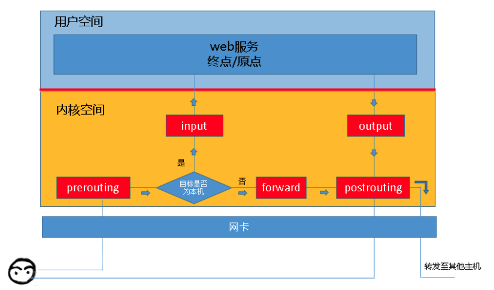

# comparison between iptables, ipvs, nftables and iptables-bpf

## About The Project 

Kubernetes provides three load balancing strategies: namespace, iptables and ipvs. Because the namespace is out of 
date, most k8s clusters adope iptables and IPVS strategies. Almose everyone knows that iptables perform poorly 
compared with IPVS, but why exactly? What's the difference between them? 

Besides, linux kernel has changed the firewall rules management system from iptables to nftables, and since the 
[bpf](https://www.kernel.org/doc/Documentation/networking/filter.txt) and [ebpf](https://ebpf.io/) project have been 
in the air, there is also an iptables implementation of bpf 
([iptables-bpf](https://github.com/mbertrone/bpf-iptables)). So we want to compare these techs as well. 

This project is attemped to compare the difference between the architecture of iptables, ipvs, nftables and 
iptables-bpf, measure the performance loss and update/insert time increment among them. 

### Built With 

* experiment target
    * [iptables](https://netfilter.org/projects/iptables/index.html)
    * [linux virtual server (ipvs)](http://www.linuxvirtualserver.org/)
    * [nftables](https://netfilter.org/projects/nftables/index.html)
    * [bpf-iptables](https://github.com/mbertrone/bpf-iptables)

* performance measurement tools
    * [iperf3](https://iperf.fr/iperf-download.php) for bandwidth measurement
    * simple shell scripts for update/insert time increment

## Getting Started 

### Experiment Environment

| Environment  |       Version |
| ------------ | ------------- |
| CentOS Linux |      7.3.1611 |
| Linux Kernel | 5.10.37-1.el7 |
| iperf3       |          3.17 |
| docker       |    18.06.3-ce |
| iptables     |        1.4.21 |
| ipvsadm      |          1.27 |
| bash         |        4.2.46 |
|              |               |

### Installation

1. repare linux environment and docker 

iptables, IPVS or nftables are free to download and use in all linux environments, so any distributions is all right.

2. Clone the repo 

```sh
git clone git@github.com:9vn6iy/iptables-experiment.git
```

3. run testing scripts

## Contents

### 1. iptables structure

iptables并不是真正的防火墙，而是一个客户端代理，用户通过代理可以将用户自定义的安全规则执行到对应的安全框架中，
例如netfilter。iptables位于用户空间，而netfilters位于内核空间。netfilter/iptables组成linux平台下的包过滤防火墙。

iptables按照rules进行包过滤；规则一般的定义为“如果数据包头符合该要求，则这样处理这个数据包”。
rules存储在kernel空间的信息包过滤表中，指定<source-address, dest-address, protocol, service-type...>

当数据包与rule匹配时，iptables就根据规则所定义的方法处理数据包。数据包的匹配过程分为多个阶段：




### 2. ipvs structure

### 3. nftables structure 

### 4. bpf and ebpf

### 5. comparison

## References

* [Linux Virtual Server for Scalable Network Services](http://www.linuxvirtualserver.org/ols/lvs.pdf)
* [benchmarking-nftables](https://developers.redhat.com/blog/2017/04/11/benchmarking-nftables)
* [optimizing-iptables-nft-large-ruleset-performance-in-user-space](https://developers.redhat.com/blog/2020/04/27/optimizing-iptables-nft-large-ruleset-performance-in-user-space)


